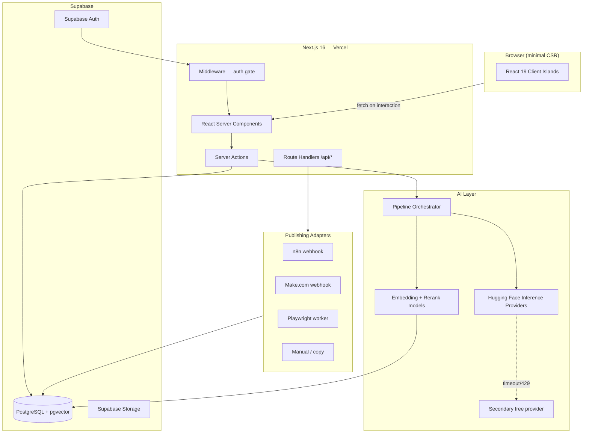
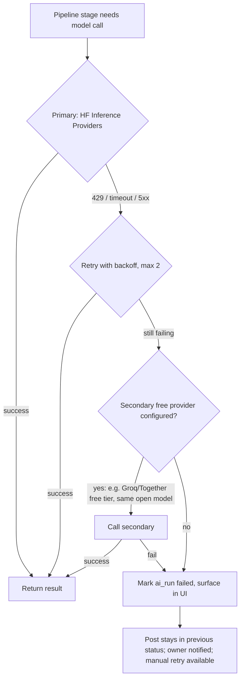

## Technical Requirements Document — LinkedIn Content Engine

Version 1.0 · Companion to 01-PRD.md

---

### 1. Architecture Overview



The application is a single Next.js 16 project. There is no separate backend service for the core CRUD surface — Server Components and Server Actions talk directly to Postgres via Prisma. The AI pipeline runs as long-lived server-side jobs (Route Handlers backing a lightweight queue table, not a separate microservice — see §5.7) because a second deployable would add operational overhead disproportionate to a single-owner tool.

### 2. Why This Stack (decision log)

Every non-trivial choice below states the alternatives considered and why they lost. This is the section the implementing agent should treat as load-bearing — do not silently substitute a different library because it seems "better"; if a genuinely superior option is found, update this document first.

#### 2.1 Next.js 16 App Router, SSR-first

**Chosen.** Next.js 16 made the App Router's Server Component model the default and shipped Cache Components (explicit, opt-in caching built on Partial Pre-Rendering) as the new caching primitive, plus stable React Compiler support. For a content-editing tool where most screens are "render data from Postgres, let the owner edit it," Server Components eliminate an entire class of client-side data-fetching code (loading spinners, `useEffect` fetches, client-side waterfalls) and ship less JavaScript by default.

**Alternative considered: Remix / React Router v7.** Comparable RSC support is less mature; Next.js has first-class Vercel deployment integration (preview URLs, edge network) which matters for a solo developer who wants zero DevOps overhead.

**Alternative considered: SPA (Vite + React Router) with a separate API.** Rejected — doubles the deployable surface (frontend + backend), reintroduces client-side data fetching everywhere, and gets none of the streaming/SSR performance benefits. For a tool whose primary cost is the owner's attention, a slower, more client-heavy app directly works against the product's goal (fast review loop).

#### 2.2 TypeScript, strict mode

**Chosen**, non-negotiable. This is a solo-maintained codebase that an AI agent will also modify; strict types are the primary defense against silent regressions when Claude Code edits files without a human re-reading every diff line by line.

#### 2.3 Tailwind CSS v4 + shadcn/ui

**Chosen.** Tailwind v4's CSS-first configuration (no `tailwind.config.js` JS build step, native CSS variables, faster builds) fits a small codebase with no design-system team to maintain a token pipeline. shadcn/ui is not a dependency but a copy-in component source — this matters because it means the design system in 04-UI-UX-Design-Brief.md is fully owned and editable, with no risk of a component-library breaking change.

**Alternative considered: Chakra UI / Mantine.** Rejected — both ship runtime CSS-in-JS or larger JS bundles, working against the SSR/minimal-JS performance goal.

#### 2.4 PostgreSQL via Supabase

**Chosen.** Supabase gives Postgres + Auth + Storage + pgvector in one managed instance with a generous free tier, which matters for a $0-infrastructure-cost target. pgvector support means knowledge-base embeddings live in the same database as the rest of the data — no separate vector database to operate, back up, or keep in sync.

**Alternative considered: dedicated vector DB (Pinecone, Weaviate, Qdrant Cloud).** Rejected for v1 — at this data scale (hundreds to low thousands of knowledge chunks), pgvector's IVFFlat/HNSW indexes are more than sufficient, and running a second stateful service is unjustified operational overhead for one user. Revisit only if knowledge base exceeds ~100k chunks, which is not a realistic scenario for a personal knowledge base.

#### 2.5 Prisma ORM (selected over Drizzle)

**Chosen: Prisma.** Rationale, stated explicitly because the brief calls for it:

| Dimension | Prisma | Drizzle | Why it matters here |
|---|---|---|---|
| Schema authoring | Declarative `schema.prisma`, single source of truth, auto-generates types | TypeScript-first schema, arguably more "native" but more verbose for large schemas | This project's schema (18+ tables) benefits from Prisma's more readable DSL for a solo maintainer and for an AI agent generating migrations |
| Migrations | `prisma migrate dev` / `deploy` — mature, widely documented, predictable diffing | `drizzle-kit` — capable but younger, more manual intervention historically needed for complex diffs | Migration reliability matters more than raw query performance for a low-traffic single-user app |
| pgvector support | Supported via raw SQL / `Unsupported("vector")` type + extensions; requires a thin raw-query layer for vector ops | Similar situation — also needs raw SQL for vector similarity | Roughly even; not a deciding factor |
| Query ergonomics | Slightly heavier runtime, generated client is large but tree-shaken adequately for server-only usage | Thinner runtime, closer to SQL, better for edge runtimes | Irrelevant here — this app does not target the Edge runtime for its data layer (see §2.7) |
| Ecosystem/docs for an AI coding agent | Extremely well-represented in training data and current docs; lower risk of the agent generating subtly wrong code | Smaller ecosystem footprint | Directly relevant: the implementing agent is Claude Code, and reducing ambiguity in generated code is a stated project goal |

Drizzle is not banned — if a specific feature (e.g., a hot query path needing hand-tuned SQL) benefits from it, that decision must be documented inline in the relevant migration/query file with rationale, per §2 preamble. Default to Prisma everywhere else.

#### 2.6 Supabase Auth (GitHub, Google, Email)

**Chosen.** Free, integrates with Postgres RLS via `auth.uid()`, supports all three requested providers out of the box. Even though there is exactly one legitimate user, real OAuth + RLS is used rather than a shortcut (hardcoded session, no-auth mode) because: (a) the app may be deployed to a public Vercel URL, and an unauthenticated content tool with business data is a real exposure; (b) implementing real auth costs almost nothing with Supabase and removes an entire category of "temporary hack that becomes permanent" risk.

Access is restricted post-auth via an allow-list of the owner's email(s) checked in middleware — anyone who authenticates via GitHub/Google but isn't the owner is redirected to a "not authorized" page. This is simpler and more robust than trying to disable public signup entirely at the Supabase project level.

#### 2.7 Runtime: Node.js runtime by default, Edge only where it helps

Server Components and Server Actions that touch Prisma run on the **Node.js runtime** (Prisma's engine is not Edge-compatible without Accelerate, which is a paid product not justified here). Static/marketing-style routes (there are effectively none in this internal tool) would be candidates for Edge; in practice, nearly the entire app runs on Node. This is a deliberate correction to the "Edge runtime where appropriate" guidance in the brief: "appropriate" here means "rarely," because the data layer dictates it.

#### 2.8 Deployment: Vercel

**Chosen.** Native Next.js support (Cache Components, Build Adapters API, preview deployments per branch/PR), free Hobby tier is sufficient for single-owner traffic. Environment variables and secrets are managed through Vercel's encrypted project settings, never committed.

**Alternative considered: self-hosted Docker on a VPS.** Documented as a valid fallback (07-Implementation notes in 06-Implementation-Plan.md include a Dockerfile) for cost or data-residency preference, but not the default — it reintroduces server maintenance for zero functional benefit at this scale.

### 3. SSR / Rendering Strategy

| Route type | Rendering | Rationale |
|---|---|---|
| `/dashboard`, `/knowledge`, `/posts`, `/posts/[id]`, `/schedule`, `/analytics` | Server Component, dynamic (per-request), streamed | Data changes per owner action; freshness matters more than cache hit rate for a single-user tool |
| `/settings/*` | Server Component, dynamic | Low traffic, correctness > speed |
| Post editor (`/posts/[id]/edit`) | Server Component shell + Client Component island for the rich-text editor and inline AI actions | The editor genuinely needs client interactivity (cursor state, optimistic updates); everything around it (sidebar, metadata panel, version history) stays server-rendered |
| Auth pages | Server Component with a small Client Component for the OAuth button interactions | Minimal JS footprint |

**Rules enforced project-wide** (mirrored in `ai/AGENTS.md`):

1. A file is a Client Component (`"use client"`) only if it uses state, effects, browser APIs, or event handlers that cannot be expressed as a Server Action form submission. Default to Server Component.
2. Data mutations go through Server Actions, not client-side `fetch` to Route Handlers, except for: (a) webhook receivers from external systems (n8n/Make/Playwright callbacks), (b) polling endpoints for long-running AI pipeline status where a Server Action's request/response model doesn't fit a live-updating UI.
3. Use `loading.tsx` + `<Suspense>` boundaries around any data fetch that can plausibly take >200ms (topic generation, pipeline stage results, analytics rollups) so the shell streams immediately.
4. Cache Components (`use cache`) are applied to genuinely stable reads only: knowledge base list views between edits, style-memory summary, prompt template listings. Anything reflecting live pipeline/job status is never cached.
5. Revalidation: mutating Server Actions call `revalidatePath`/`revalidateTag` for the exact affected routes — no blanket revalidation of the whole app.

### 4. Content Generation Pipeline — Stage Contract

Every stage is a discrete, independently retryable unit with a typed input/output contract persisted to `post_versions`. No stage is allowed to do more than one job — this is the direct antidote to "one mega-prompt that does everything," which is explicitly disallowed by the product brief.

```mermaid
flowchart LR
    K[Knowledge Retrieval] --> BC[Business Context Merge]
    BC --> TA[Target Audience Framing]
    TA --> PP[Pain Point Mapping]
    PP --> CO[Content Opportunity Scoring]
    CO --> TS[Topic Selection — owner gate]
    TS --> R[Research / Fact Assembly]
    R --> O[Outline]
    O --> W[Writing]
    W --> H[Humanization]
    H --> QR[Quality Review]
    QR -->|fail| W
    QR -->|pass| G[Grammar Pass]
    G --> CTA[CTA Generation]
    CTA --> APPROVE[Owner Approval — gate]
    APPROVE --> SCHED[Scheduling]
    SCHED --> PUB[Publishing]
    PUB --> AN[Analytics Ingestion]
    AN --> L[Learning Loop Update]
    L -.feeds.-> K
```



| Stage | Purpose | Primary input | Output | Model / service (see §5) |
|---|---|---|---|---|
| Knowledge Retrieval | Pull the top-K relevant knowledge chunks for the working topic/pillar | Topic text or seed idea + pillar | Ranked knowledge chunks with source refs | Embedding model + cross-encoder reranker |
| Business Context Merge | Attach positioning/ICP/offer context so generic knowledge becomes business-relevant | Retrieved chunks + `settings.business_context` | Context brief (structured JSON) | Small/fast LLM (classification-grade) |
| Target Audience Framing | Decide who this specific post is speaking to | Context brief + `settings.target_audience` | Audience frame (role, seniority, concern) | Small/fast LLM |
| Pain Point Mapping | Identify which specific pain point this post addresses | Audience frame + knowledge chunks | 1–3 candidate pain points | Small/fast LLM |
| Content Opportunity Scoring | Score topic worthiness (novelty, proof strength, pillar coverage gap) | All prior outputs + recent post history | Scored opportunity object | Reasoning-capable LLM |
| Topic Selection | **Owner decision point**, not an AI stage | Ranked opportunities | Selected topic | — (UI action) |
| Research | Assemble concrete facts/details to write from (numbers, quotes, timeline) strictly from the knowledge base — never invented | Selected topic + full knowledge chunks | Fact sheet with source citations | Reasoning-capable LLM, low temperature |
| Outline | Structure: hook, narrative arc, proof point placement, CTA slot | Fact sheet | Ordered outline (sections + intent per section) | Reasoning-capable LLM |
| Writing | First full draft prose | Outline + fact sheet + style memory | Draft text | General-purpose writing LLM |
| Humanization | Rewrite to match the owner's actual voice; remove AI-pattern language | Draft + style memory profile + banned-phrase list | Humanized draft | General-purpose writing LLM, style-conditioned prompt |
| Quality Review | Score against a rubric (specificity, AI-slop markers, hook strength, pillar fit); route back to Writing on fail | Humanized draft + rubric | Score + structured feedback; pass/fail | Reasoning-capable LLM, structured output |
| Grammar | Deterministic grammar/spelling pass | Reviewed draft | Corrected draft + change list | LanguageTool (rule-based, not an LLM — see §5.5) |
| CTA Generation | Propose 2–3 CTA variants matching post intent | Corrected draft | CTA options | Small/fast LLM |
| Owner Approval | **Owner decision point** | Final draft + CTA options | Approved post | — (UI action) |
| Scheduling | Assign publish time (owner-picked or auto-suggested optimal slot from analytics) | Approved post | Scheduled job | Deterministic logic, optional heuristic from analytics rollups |
| Publishing | Hand off to a provider adapter | Scheduled job | Publish result / error | Adapter (§6) |
| Analytics Ingestion | Pull or accept performance data | Published post reference | Metrics record | Manual entry or Playwright adapter |
| Learning Loop | Update style memory + topic ranking weights | Feedback + metrics | Updated style memory / weights | Deterministic aggregation + periodic LLM summarization of style drift |

Each LLM-backed stage is implemented as its own versioned prompt template (`prompt_templates` table) so a stage's prompt can be iterated without touching code, and every invocation is logged to `ai_runs` for cost/latency/quality auditing (PRD FR-8).

### 5. AI Model Stack

#### 5.1 Selection Principles

1. Default to free-tier-accessible open-weight models via Hugging Face Inference Providers.
2. Match model size/capability to task difficulty — do not use a large reasoning model for a classification-grade task; it wastes free-tier quota and adds latency.
3. Every stage's model is configurable at runtime via the `prompt_templates`/`model_config` tables, not hardcoded — this is FR-12 and is essential because free-model availability and quality shift often; the system must be able to swap models without a redeploy.
4. Prefer models with permissive licenses (Apache 2.0 / MIT) to avoid any future ambiguity about commercial use of generated content.

#### 5.2 Model Assignment by Stage

| Stage(s) | Model | Family/License | Why this model | Approx. latency (free tier, cold-safe estimate) |
|---|---|---|---|---|
| Business Context Merge, Target Audience Framing, Pain Point Mapping, CTA Generation | **Qwen3-8B-Instruct** | Qwen, Apache 2.0 | Small enough to stay well inside free-tier rate limits, strong instruction-following for structured/classification-style tasks, good multilingual robustness if content ever needs localization | 1–3s |
| Content Opportunity Scoring, Research, Outline, Quality Review | **DeepSeek-R1-Distill-Qwen-14B** (or current DeepSeek reasoning-distill of similar size) | DeepSeek, MIT | These stages require actual reasoning — scoring tradeoffs, assembling a coherent fact sheet without inventing facts, and critiquing a draft against a rubric. Distilled reasoning models substantially outperform same-size instruct models on this class of task while staying small enough for free-tier serving | 4–10s |
| Writing, Humanization | **Qwen3-32B-Instruct** (fallback: Qwen3-8B if rate-limited) | Qwen, Apache 2.0 | Best balance of prose quality, instruction-following for style constraints, and availability on free serverless inference among current open-weight options; Apache 2.0 avoids any license friction | 6–15s |
| Grammar | **LanguageTool** (self-hosted, open-source, rule-based — not an LLM) | Open source | Grammar/spelling correction does not benefit from LLM non-determinism and hallucination risk; a rule-based tool is faster, free, deterministic, and produces an explicit change list the owner can trust. Reserving the LLM budget for stages that actually need generative capability is a direct cost/quality optimization | <1s |
| Knowledge embeddings | **BAAI/bge-base-en-v1.5** | Sentence-transformers family, MIT | Strong retrieval quality for its size relative to `all-MiniLM-L6-v2`; still small/cheap enough to run per-item on write. Fallback to `all-MiniLM-L6-v2` if latency becomes an issue at scale | <500ms per chunk |
| Reranking retrieved knowledge | **cross-encoder/ms-marco-MiniLM-L-6-v2** | Sentence-transformers cross-encoder, Apache 2.0 | Reranking the top ~20 embedding-similarity candidates down to the top ~5 meaningfully improves what actually reaches the Writing stage, at negligible extra latency because it only scores a short list | <1s for top-20 |
| Style-drift summarization (periodic, not per-post) | **Qwen3-8B-Instruct** | Qwen, Apache 2.0 | Lightweight periodic job (weekly), not on the critical path of a single post | 2–5s |

Model identifiers above name current-generation open-weight families as of this document's writing; because open-weight model releases move quickly, §5.6 defines how the system keeps this current without a rewrite.

#### 5.3 Input/Output Contracts (representative)

**Writing stage**

- Input: `{ outline: OutlineSection[], factSheet: Fact[], styleMemory: StyleProfile, pillar: Pillar, targetLength: "short"|"medium"|"long" }`
- Output: `{ draftText: string, sectionsUsed: string[], factsCited: FactRef[] }`
- Constraint enforced in the prompt template: every concrete claim in the draft must trace to a `factsCited` entry; the model is instructed to never invent statistics, client names, or outcomes not present in the fact sheet.

**Quality Review stage**

- Input: `{ draftText: string, rubric: QualityRubric, bannedPhrases: string[], stylistTargets: StyleProfile }`
- Output: `{ pass: boolean, scores: { specificity: number, voiceMatch: number, hookStrength: number, slopMarkers: string[] }, feedback: string }`
- `slopMarkers` is a structured list (not free text) so the UI can highlight exactly which spans triggered a flag.

#### 5.4 "AI Slop" Guardrails (enforced, not optional)

The Humanization and Quality Review prompt templates hard-code a checklist the model must actively avoid/flag, seeded from the brief and expanded with known LinkedIn-AI-tell patterns:

- Opening with "In today's fast-paced world," "I'm excited to announce," "Let's dive in," or any generic scene-setter not grounded in a specific detail.
- Rule-of-three list constructions used more than once per post ("It's not just X, it's Y, it's Z").
- Em-dash overuse (more than 2 per post is flagged).
- Generic CTAs ("What are your thoughts? Let me know in the comments!") unless explicitly requested.
- Hedging filler ("I think," "In my opinion," "Overall," "In conclusion").
- Emoji-as-bullet-point patterns (🔹, ✅, 🚀 used as list markers) unless the owner's actual style memory shows genuine, intentional use.
- Buzzword stacking ("leverage synergies to unlock game-changing value").

This list is stored in `prompt_templates` as data, not hardcoded in application code, so it can be extended as new AI-tells emerge without a deploy.

#### 5.5 Grammar: Why Not an LLM

LanguageTool is run as a small self-hosted Docker sidecar (or called via its free public API for low volume) rather than adding another LLM call. Rationale: grammar correction is a solved, deterministic problem; using a generative model risks it "improving" phrasing beyond grammar (silently undoing Humanization stage work) and costs free-tier quota for no quality gain. This is the single clearest instance in the pipeline of choosing the boring, correct tool over a generative one.

#### 5.6 Fallback Strategy



- No paid API is ever called automatically. A paid fallback (e.g., an Anthropic or OpenAI key) may be configured by the owner in Settings for a specific stage, but it is opt-in per stage and clearly labeled with an estimated cost — this satisfies "prioritize free models" while not making the system brittle to free-tier outages if the owner decides the tradeoff is worth it for a specific high-value stage (commonly Writing or Quality Review).
- All model calls go through a single internal `ModelRouter` abstraction (`lib/ai/model-router.ts`) so stage code never calls a provider SDK directly — this is what makes swapping a model a configuration change, not a code change.

#### 5.7 Pipeline Execution Model

Long-running, multi-stage generation cannot happen inside a single Server Action invocation (serverless function time limits, and the owner should be able to navigate away mid-generation). The pipeline runs as an async job:

1. A Server Action creates a `pipeline_run` row (status `queued`) and returns immediately; the UI shows a live status via polling a Route Handler (`/api/pipeline-runs/[id]/status`) or Supabase Realtime subscription on the row.
2. A Route Handler (`/api/pipeline-runs/[id]/tick`), invoked by a cron trigger (Vercel Cron, every 1 minute) or a manual "run next stage" action, advances the run by one stage, persists the `post_version`, and updates status.
3. Stage failures are retried per §5.6; after exhausting retries the run status becomes `failed` with the error surfaced in the UI and a manual "retry this stage" action available.

This queue-via-Postgres approach avoids standing up Redis/a dedicated job runner (again: proportional engineering for one user) while still being resumable and observable.

### 6. Publishing Adapter Architecture

LinkedIn's official API does not support posting on behalf of a personal member account without a restrictive partner program most individuals cannot access. The system therefore treats "getting a post onto LinkedIn" as an external, swappable concern behind a single interface:

```typescript
interface PublishingProvider {
  readonly id: string; // "n8n" | "make" | "playwright" | "manual" | future
  schedulePost(input: SchedulePostInput): Promise<ProviderJobRef>;
  publishNow(input: PublishNowInput): Promise<ProviderJobRef>;
  getStatus(ref: ProviderJobRef): Promise<PublishStatus>;
  cancel(ref: ProviderJobRef): Promise<void>;
}
```

| Provider | Mechanism | When to use | Failure characteristics |
|---|---|---|---|
| **n8n** | App calls an n8n webhook with post payload; n8n workflow (owned separately, e.g. self-hosted n8n or n8n cloud) handles LinkedIn posting via whatever method the owner has configured on that side (session-based automation, third-party connector, etc.) | Preferred default — owner already comfortable with n8n, keeps LinkedIn-session risk outside this codebase | Webhook timeout/non-2xx marks job `failed`; status polling via a second n8n webhook or callback |
| **Make.com** | Same pattern as n8n via a Make webhook | Equivalent alternative if the owner prefers Make's UI for that specific workflow | Same as above |
| **Playwright** | Self-hosted worker (small Node service or a scheduled job) drives a real browser session against linkedin.com using a securely stored session cookie, typing and submitting the post | Fallback when no automation platform is configured; also the only option if the owner wants zero third-party workflow tools involved | Most fragile — LinkedIn DOM/session changes can break it silently; must include a smoke-test step (screenshot on failure) and alerting |
| **Manual** | App marks the post "ready to publish," shows a copy-to-clipboard button and the exact scheduled time, and sends a reminder (email or in-app) | Guaranteed-to-work fallback; zero automation risk | No failure mode other than the owner forgetting — mitigated by reminders |

Adding a fifth provider (e.g., a future Unipile-based managed API, which offers LinkedIn access through a compliant managed service rather than the restrictive official Marketing API) requires only a new class implementing `PublishingProvider` and a config row in `automation_providers` — no changes to `posts`, `schedules`, or any Server Action.

Credentials (n8n/Make webhook URLs with secrets, Playwright session cookies) are never stored in the application database in plaintext — they are stored as references to entries in Vercel/Supabase environment secrets or a dedicated encrypted `secrets` table (application-layer encryption, key from environment) if per-provider runtime configuration is needed beyond static env vars.

### 7. Security

| Concern | Approach |
|---|---|
| AuthN | Supabase Auth (GitHub/Google/Email); session cookies, HTTP-only, secure |
| AuthZ | Postgres RLS on every table keyed to `owner_id = auth.uid()`; owner allow-list checked in middleware in addition to RLS (defense in depth) |
| Secrets | Environment variables via Vercel encrypted project settings; never in the repo, never in the database in plaintext; `.env.example` documents required keys with no real values |
| CSRF | Server Actions have built-in Next.js CSRF protection (origin checking); Route Handlers receiving external webhooks (n8n/Make/Playwright callbacks) are authenticated via a shared-secret header, not cookies |
| XSS | React's default escaping; rich-text editor content sanitized on write (DOMPurify or equivalent) before persisting and before any `dangerouslySetInnerHTML` usage, which should be avoided entirely if feasible |
| SQL injection | Prisma parameterizes all queries by default; raw SQL (needed for pgvector similarity search) uses parameterized `$queryRaw` exclusively, never string concatenation |
| Rate limiting | Route Handlers accepting external webhooks are rate-limited (e.g., Upstash Redis free tier or an in-Postgres token-bucket table) to prevent abuse of publicly reachable endpoints |
| Input validation | All Server Action and Route Handler inputs validated with Zod schemas before touching the database or an AI call |
| CSP | Strict Content-Security-Policy header via `next.config` — no inline scripts, allowlisted external origins only (Supabase, Hugging Face, configured webhook targets) |
| Audit logging | Every mutating action (publish, schedule change, knowledge deletion, settings change) writes an `audit_logs` row with actor, action, before/after diff where practical |
| Encryption | Supabase-managed encryption at rest for the database; application-layer encryption (AES-256-GCM, key from env) for any sensitive config value that must live in a table (e.g., a Playwright session cookie) |
| Least privilege | Service-role Supabase key (which bypasses RLS) is used only in trusted server contexts (cron/queue processing), never exposed to the client, never used in a Server Action reachable from user input without an explicit owner-identity check first |

### 8. Performance

| Target | Approach |
|---|---|
| Lighthouse ≥ 95 | Server Components by default, `next/image` for all images, font subsetting via `next/font`, no unnecessary client bundles |
| Fast FCP/LCP | Streaming with `<Suspense>`, Cache Components for stable reads, avoid render-blocking client JS above the fold |
| Low CLS | Explicit dimensions on all media, skeleton components matched to real content dimensions (04-UI-UX-Design-Brief.md) |
| Minimal JS | Client Components limited to the editor island, command palette, and interactive charts; everything else server-rendered |
| Lazy loading | Below-the-fold content (analytics charts, version history panels) code-split and loaded on interaction/visibility |

### 9. SEO

Low priority — this is an internal tool with authenticated-only routes and no public content surface. `robots.txt` disallows all crawling. Metadata API is used minimally (page titles for browser tab clarity, no OpenGraph/structured data needed since nothing is publicly indexable).

### 10. Cross-References

- Database schema implementing every table named above: `05-Backend-Schema.md`.
- User-facing flow through the pipeline stages and approval gates: `03-App-Flow.md`.
- Component-level design tokens for the UI described here: `04-UI-UX-Design-Brief.md`.
- Phased build order for this architecture: `06-Implementation-Plan.md`.
