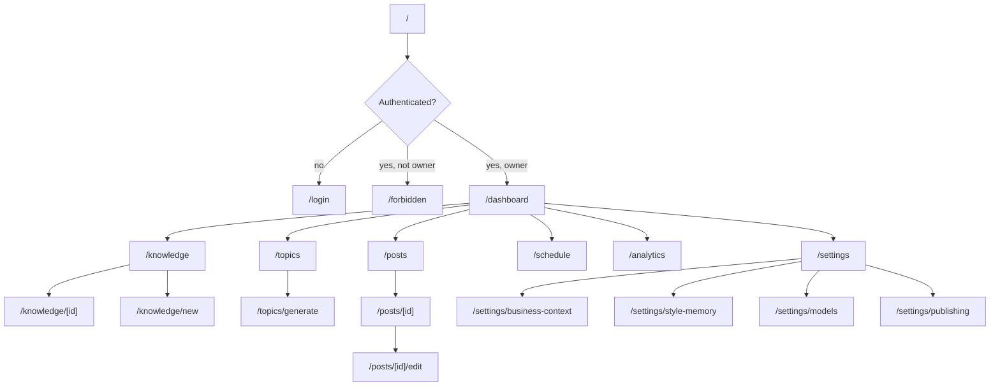
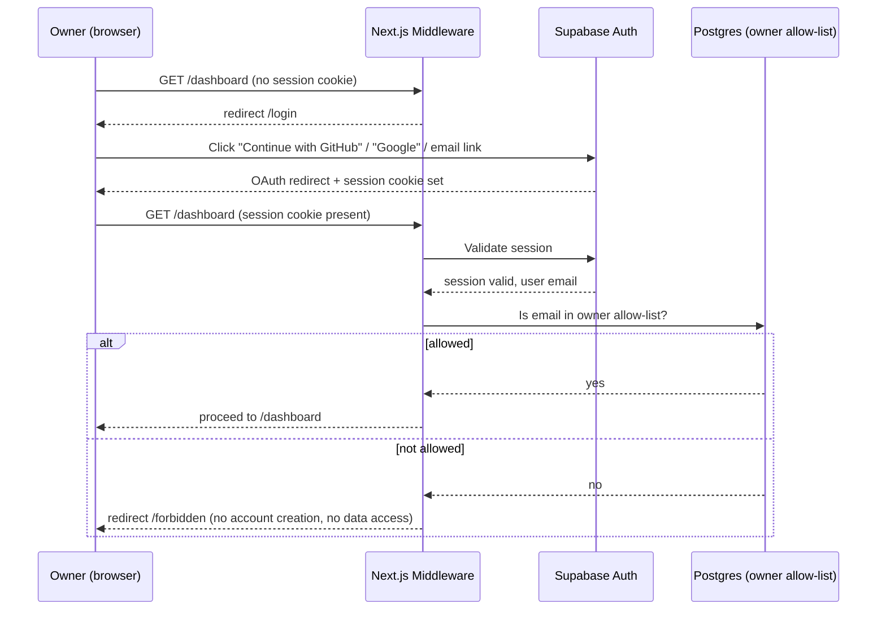
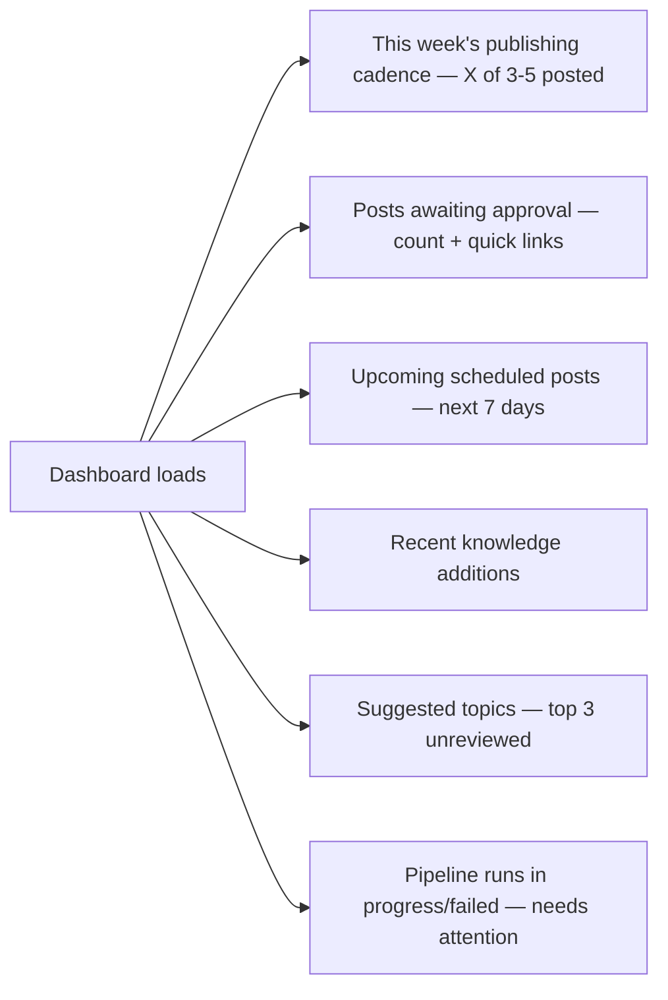
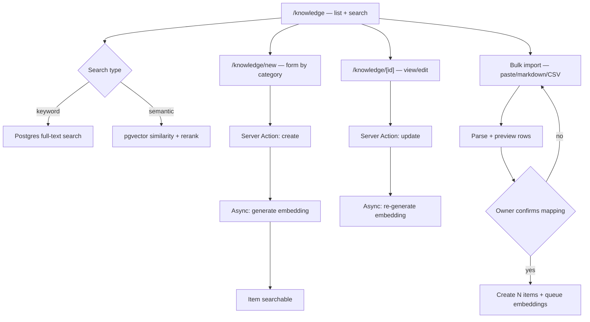
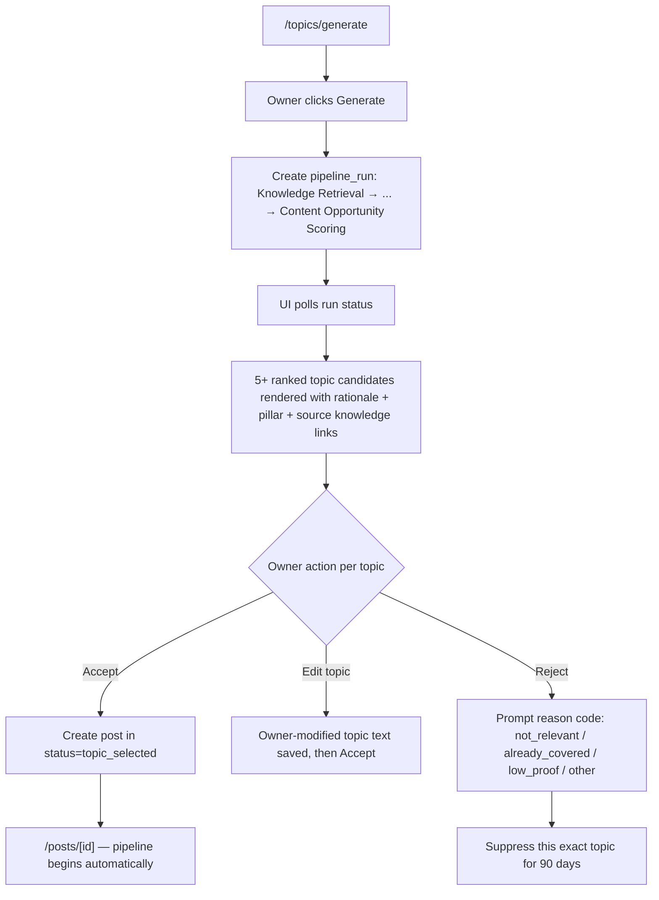
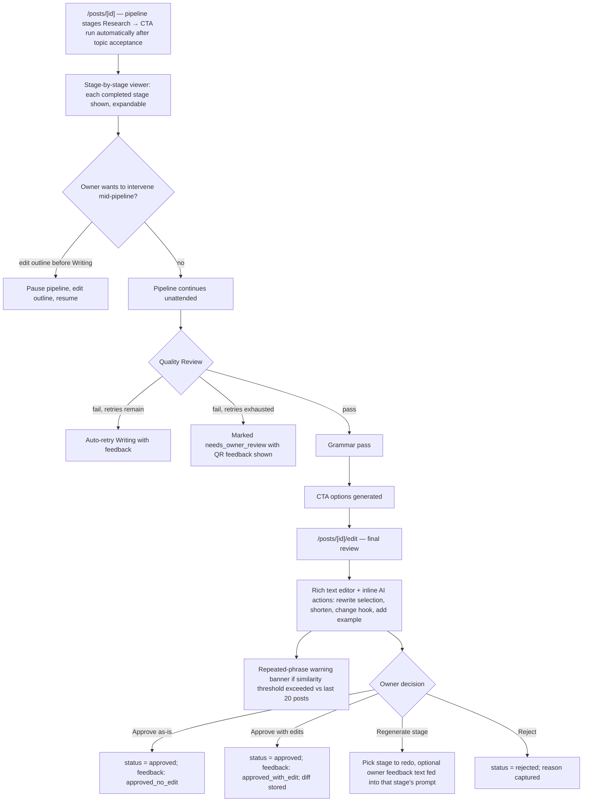
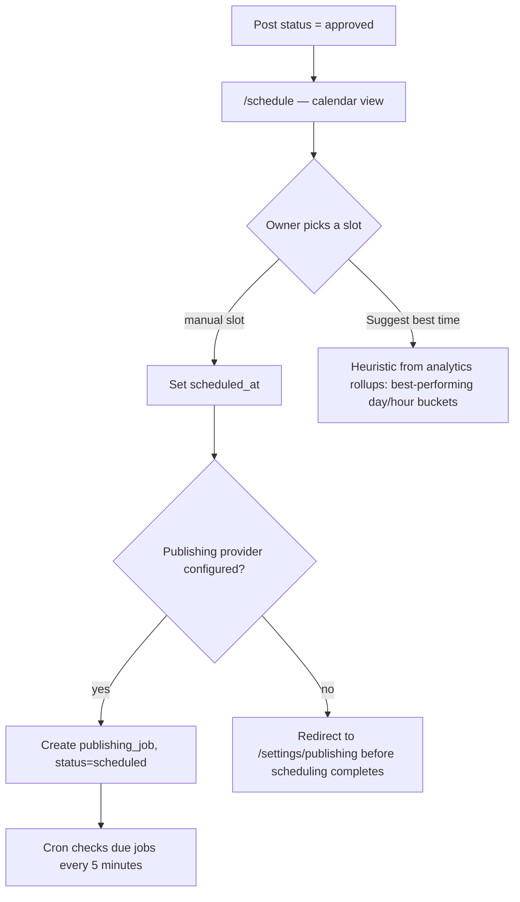
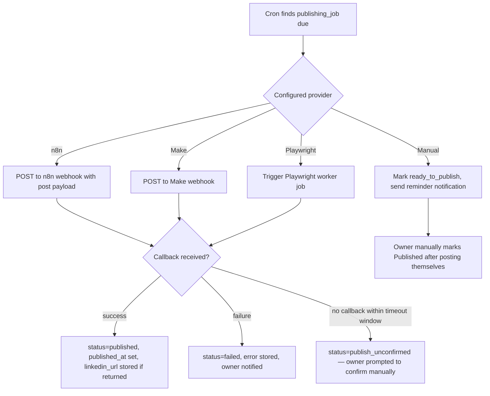
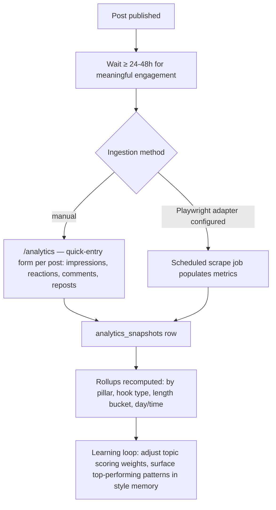
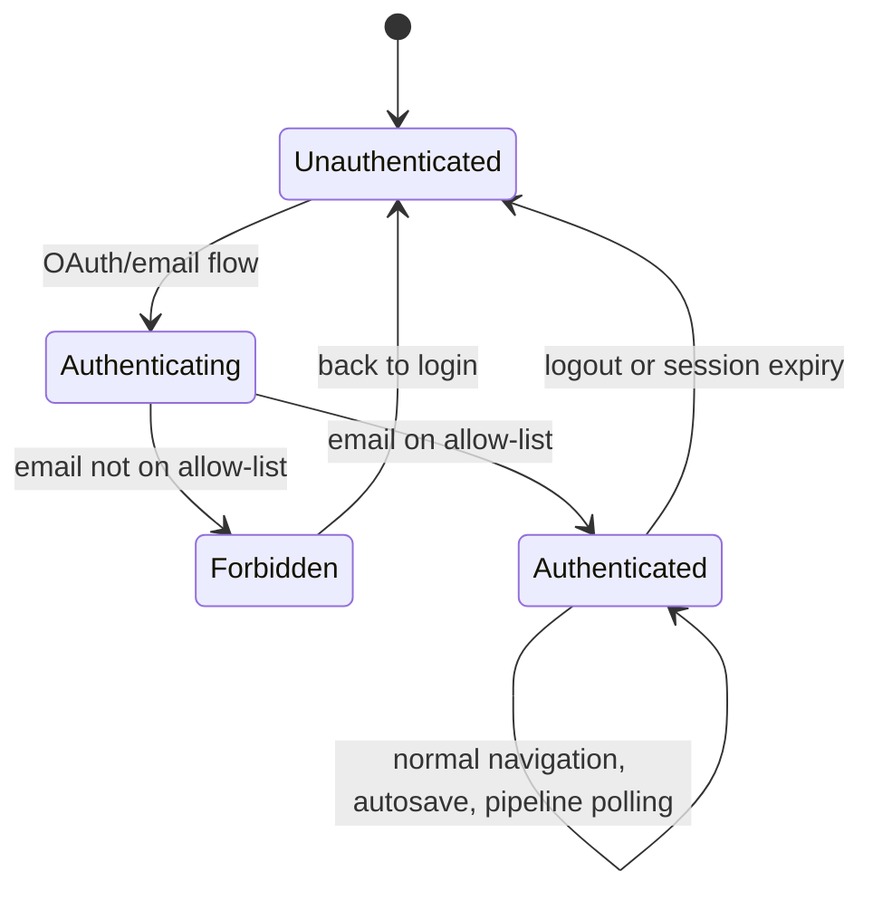

## Application Flow — LinkedIn Content Engine

Version 1.0 · Every route, state, and edge case a session can pass through

---

### 1. Route Map

### 2. Authentication Flow

**Edge cases:**

- **Session expiry mid-edit:** the post editor autosaves drafts every 15s to a Server Action; on a 401 from any Server Action, the client shows a non-destructive "Your session expired — sign in again" modal that preserves unsaved local editor state in memory and re-submits after re-auth, rather than discarding it.
- **Logout:** clears the Supabase session and redirects to `/login`; no server-side state is cleared (nothing user-specific lives outside the database).
- **Unauthorized email:** shown `/forbidden` with no indication of what would make them authorized — this is a personal tool, not a signup flow.

### 3. Dashboard

Loading state: the shell (nav, page title) renders immediately; each panel (`Suspense` boundary) streams in independently with a skeleton matched to its final layout. If the AI pipeline has a failed run, a persistent (non-dismissable until resolved) banner surfaces it — failures must never be silently swallowed (PRD NFR: availability).

Empty state (first run, no knowledge yet): dashboard replaces panels with a single onboarding card: "Add your first knowledge item to get started" → links to `/knowledge/new`.

### 4. Knowledge Base Flow

**Error/edge cases:**

- Embedding generation fails (model call error): item is saved immediately (never block on the AI call) with `embedding_status = pending`; a background retry job picks it up. The item is still keyword-searchable in the meantime, just not semantically searchable — surfaced with a small "indexing…" badge, not a blocking error.
- Bulk import with malformed rows: invalid rows are shown in a rejected list with the specific validation error per row; valid rows proceed independently — partial success is allowed and communicated, not all-or-nothing.

### 5. Topic Generation Flow

**Diversity enforcement (FR-4):** if the scoring stage returns candidates skewed to one pillar, the UI shows a non-blocking note ("4 of 5 topics are Case Studies — knowledge base may be thin on other pillars") rather than silently hiding candidates; the owner decides.

**Failure case:** if the pipeline run fails before producing candidates (e.g., model provider outage), the screen shows the exact failed stage, the error, and a "Retry" button — never a generic "Something went wrong."

### 6. Draft Generation & Editing Flow

**Edge case — regenerate from an earlier stage:** regenerating the Outline after Writing has already run invalidates (soft, not deleted) the downstream `post_versions`; the UI clearly marks them as "superseded" rather than removing history, preserving the learning-loop audit trail (PRD FR-11).

**Edge case — AI call timeout during an interactive inline action (e.g., "rewrite this paragraph"):** the editor shows the specific selection as "regenerating…" without blocking the rest of the document; on failure, the selection reverts to its prior text with a toast explaining the failure and a retry affordance.

### 7. Scheduling Flow

### 8. Publishing Flow

**Failure recovery:** a `failed` publishing job can be retried (same payload, re-dispatched) or the post can be reverted to `approved` and re-scheduled. A `publish_unconfirmed` state exists specifically because webhook-based automation cannot guarantee a callback — the UI never assumes success without either a callback or explicit owner confirmation.

### 9. Analytics Flow

Empty state: before any metrics exist, `/analytics` shows a prompt to enter data for the oldest unrecorded published post rather than a blank chart.

### 10. Settings Flows

- **Business Context:** structured form (positioning statement, ideal client profile, offers/services, industries served) — this is the input every pipeline stage ultimately traces back to; changes here do not retroactively alter published posts but do affect the next generation run.
- **Style Memory:** read-only computed profile (sentence length distribution, emoji frequency, hook pattern frequency, vocabulary list) plus an owner-editable "always avoid these phrases" list and "these are examples of my voice" curated post picker (marks specific published posts as canonical style references).
- **Models:** per-stage model selection dropdown (populated from configured providers), showing current default, with a "reset to recommended" action per stage.
- **Publishing:** provider configuration (webhook URLs, Playwright session status, manual reminder preferences), each provider's connection tested via a "Send test payload" action before being marked active.

### 11. Global Error, Empty, and Loading State Conventions

| State | Convention |
|---|---|
| Loading | Skeleton components matching final content dimensions (never a generic spinner for content-shaped regions); a spinner is acceptable only for button-level, sub-second actions |
| Empty | Always actionable — an empty list state names the specific next action, never just "No data" |
| Error (recoverable) | Inline, scoped to the failed region; includes the specific cause where known and a retry action |
| Error (session/auth) | Full-page interstitial, preserves in-progress work where technically possible |
| AI pipeline failure | Names the exact failed stage, shows the error, offers retry-this-stage — never restarts the whole pipeline unless the owner explicitly chooses to |
| Automation/publishing failure | Never silently marked published; always requires either a success callback or explicit owner confirmation |

### 12. Session Lifecycle Summary

