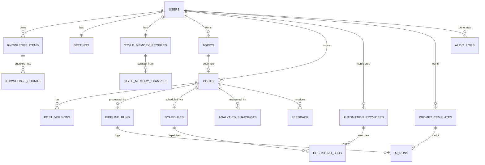

## Backend Schema — LinkedIn Content Engine

Version 1.0 · PostgreSQL (Supabase) + Prisma + pgvector

---

### 1. Entity Relationship Overview



### 2. Prisma Schema

```prisma
// schema.prisma
generator client {
  provider = "prisma-client-js"
}

datasource db {
  provider  = "postgresql"
  url       = env("DATABASE_URL")      // pooled connection (pgbouncer, Supabase transaction mode)
  directUrl = env("DIRECT_URL")        // direct connection, used for migrations only
  extensions = [vector, pgcrypto]
}

// ─────────────────────────────────────────────────────────────────────────
// ENUMS
// ─────────────────────────────────────────────────────────────────────────

enum KnowledgeCategory {
  PROJECT
  PRODUCT
  CASE_STUDY
  CLIENT_WIN
  LESSON_LEARNED
  SERVICE
  PORTFOLIO_ITEM
  FAQ
  WRITING_STYLE_NOTE
  BRAND_VOICE_NOTE
  INDUSTRY
  TARGET_CLIENT
  EXPERIENCE
  PREVIOUS_POST
  IDEA
}

enum Pillar {
  BUILD_IN_PUBLIC
  CASE_STUDY
  TECHNICAL_INSIGHT
  FOUNDER_STORY
  LESSON_LEARNED
  EDUCATIONAL
  MARKETING_BUSINESS_GROWTH
}

enum TopicStatus {
  SUGGESTED
  ACCEPTED
  REJECTED
  EXPIRED
}

enum RejectReasonCode {
  NOT_RELEVANT
  ALREADY_COVERED
  LOW_PROOF
  OTHER
}

enum PostStatus {
  PIPELINE_RUNNING
  NEEDS_OWNER_REVIEW
  IN_EDIT
  APPROVED
  SCHEDULED
  PUBLISHING
  PUBLISHED
  PUBLISH_UNCONFIRMED
  FAILED
  REJECTED
  ARCHIVED
}

enum PipelineStage {
  KNOWLEDGE_RETRIEVAL
  BUSINESS_CONTEXT_MERGE
  TARGET_AUDIENCE_FRAMING
  PAIN_POINT_MAPPING
  CONTENT_OPPORTUNITY_SCORING
  RESEARCH
  OUTLINE
  WRITING
  HUMANIZATION
  QUALITY_REVIEW
  GRAMMAR
  CTA_GENERATION
}

enum PipelineRunStatus {
  QUEUED
  RUNNING
  PAUSED
  FAILED
  COMPLETED
}

enum PublishingProviderType {
  N8N
  MAKE
  PLAYWRIGHT
  MANUAL
}

enum PublishingJobStatus {
  SCHEDULED
  DISPATCHED
  PUBLISHED
  PUBLISH_UNCONFIRMED
  FAILED
  CANCELLED
}

enum FeedbackType {
  APPROVED_NO_EDIT
  APPROVED_WITH_EDIT
  REJECTED
  REGENERATED
}

enum AiRunStatus {
  SUCCESS
  FAILED
  TIMEOUT
  RATE_LIMITED
}

// ─────────────────────────────────────────────────────────────────────────
// CORE
// ─────────────────────────────────────────────────────────────────────────

model User {
  id            String   @id @default(dbgenerated("auth.uid()")) @db.Uuid
  email         String   @unique
  displayName   String?
  createdAt     DateTime @default(now())
  updatedAt     DateTime @updatedAt

  settings              Settings?
  styleMemoryProfile    StyleMemoryProfile?
  knowledgeItems        KnowledgeItem[]
  topics                Topic[]
  posts                 Post[]
  automationProviders   AutomationProvider[]
  promptTemplates       PromptTemplate[]
  auditLogs             AuditLog[]

  @@map("users")
}

model Settings {
  id                  String   @id @default(dbgenerated("gen_random_uuid()")) @db.Uuid
  ownerId             String   @unique @db.Uuid
  owner               User     @relation(fields: [ownerId], references: [id], onDelete: Cascade)

  positioningStatement String?
  idealClientProfile   String?
  offers               Json     @default("[]")   // Array<{ name, description }>
  industriesServed     String[] @default([])
  targetAudienceNotes  String?
  painPointNotes       String?
  brandVoiceNotes      String?

  defaultPostLength    String   @default("medium") // short | medium | long
  weeklyPostingGoalMin Int      @default(3)
  weeklyPostingGoalMax Int      @default(5)

  createdAt DateTime @default(now())
  updatedAt DateTime @updatedAt

  @@map("settings")
}

// ─────────────────────────────────────────────────────────────────────────
// KNOWLEDGE BASE
// ─────────────────────────────────────────────────────────────────────────

model KnowledgeItem {
  id          String            @id @default(dbgenerated("gen_random_uuid()")) @db.Uuid
  ownerId     String            @db.Uuid
  owner       User              @relation(fields: [ownerId], references: [id], onDelete: Cascade)

  category    KnowledgeCategory
  title       String
  body        String            // markdown source of truth
  tags        String[]          @default([])
  pillarHints Pillar[]          @default([])

  sourceUrl   String?           // optional link to original artifact (proposal doc, etc.)
  archived    Boolean           @default(false)

  createdAt   DateTime          @default(now())
  updatedAt   DateTime          @updatedAt

  chunks      KnowledgeChunk[]

  @@index([ownerId, category])
  @@index([ownerId, archived])
  @@map("knowledge_items")
}

model KnowledgeChunk {
  id              String        @id @default(dbgenerated("gen_random_uuid()")) @db.Uuid
  knowledgeItemId String        @db.Uuid
  knowledgeItem   KnowledgeItem @relation(fields: [knowledgeItemId], references: [id], onDelete: Cascade)

  ordinal         Int           // position within the parent item
  content         String
  embedding       Unsupported("vector(768)")? // bge-base-en-v1.5 = 768 dims
  embeddingModel  String?       // e.g. "BAAI/bge-base-en-v1.5"
  embeddingStatus String        @default("pending") // pending | ready | failed

  createdAt       DateTime      @default(now())

  @@index([knowledgeItemId])
  @@map("knowledge_chunks")
}

// ─────────────────────────────────────────────────────────────────────────
// STYLE MEMORY
// ─────────────────────────────────────────────────────────────────────────

model StyleMemoryProfile {
  id                    String   @id @default(dbgenerated("gen_random_uuid()")) @db.Uuid
  ownerId               String   @unique @db.Uuid
  owner                 User     @relation(fields: [ownerId], references: [id], onDelete: Cascade)

  avgSentenceLength     Float?
  emojiUsageRate        Float?           // emojis per 100 words, trailing 20-post window
  hookPatterns          Json     @default("[]")  // Array<{ pattern, frequency }>
  ctaPatterns           Json     @default("[]")
  favoriteVocabulary    String[] @default([])
  avoidedPhrases        String[] @default([])    // owner-curated, always excluded
  repeatedPhraseIndex   Json     @default("[]")  // rolling frequency map, last 20 posts
  lastComputedAt        DateTime?

  createdAt             DateTime @default(now())
  updatedAt              DateTime @updatedAt

  examples               StyleMemoryExample[]

  @@map("style_memory_profiles")
}

model StyleMemoryExample {
  id                     String              @id @default(dbgenerated("gen_random_uuid()")) @db.Uuid
  styleMemoryProfileId   String              @db.Uuid
  styleMemoryProfile     StyleMemoryProfile  @relation(fields: [styleMemoryProfileId], references: [id], onDelete: Cascade)
  postId                 String?             @db.Uuid
  post                   Post?               @relation(fields: [postId], references: [id], onDelete: SetNull)

  note                   String?             // why this is a good style reference

  createdAt              DateTime            @default(now())

  @@map("style_memory_examples")
}

// ─────────────────────────────────────────────────────────────────────────
// TOPICS
// ─────────────────────────────────────────────────────────────────────────

model Topic {
  id                 String            @id @default(dbgenerated("gen_random_uuid()")) @db.Uuid
  ownerId            String            @db.Uuid
  owner              User              @relation(fields: [ownerId], references: [id], onDelete: Cascade)

  title              String
  rationale          String
  pillar             Pillar
  sourceKnowledgeIds String[]          @default([])
  score              Float?
  status             TopicStatus       @default(SUGGESTED)
  rejectReasonCode   RejectReasonCode?
  rejectReasonNote   String?
  suppressedUntil    DateTime?         // 90-day suppression on reject (FR-4/§13 PRD)

  createdAt          DateTime          @default(now())
  updatedAt          DateTime          @updatedAt

  post               Post?

  @@index([ownerId, status])
  @@map("topics")
}

// ─────────────────────────────────────────────────────────────────────────
// POSTS + PIPELINE
// ─────────────────────────────────────────────────────────────────────────

model Post {
  id             String     @id @default(dbgenerated("gen_random_uuid()")) @db.Uuid
  ownerId        String     @db.Uuid
  owner          User       @relation(fields: [ownerId], references: [id], onDelete: Cascade)
  topicId        String?    @unique @db.Uuid
  topic          Topic?     @relation(fields: [topicId], references: [id], onDelete: SetNull)

  pillar         Pillar
  status         PostStatus @default(PIPELINE_RUNNING)

  finalText      String?
  ctaText        String?
  wordCount      Int?

  archived       Boolean    @default(false)

  createdAt      DateTime   @default(now())
  updatedAt      DateTime   @updatedAt

  versions       PostVersion[]
  pipelineRuns   PipelineRun[]
  schedule       Schedule?
  analytics      AnalyticsSnapshot[]
  feedback       Feedback[]
  styleExamples  StyleMemoryExample[]

  @@index([ownerId, status])
  @@index([ownerId, pillar])
  @@map("posts")
}

model PostVersion {
  id           String        @id @default(dbgenerated("gen_random_uuid()")) @db.Uuid
  postId       String        @db.Uuid
  post         Post          @relation(fields: [postId], references: [id], onDelete: Cascade)

  stage        PipelineStage
  content      Json          // stage-specific structured output, see 02-TRD.md §4
  supersededBy String?       @db.Uuid  // self-reference to the version that replaced it, if regenerated

  createdAt    DateTime      @default(now())

  @@index([postId, stage])
  @@map("post_versions")
}

model PipelineRun {
  id          String             @id @default(dbgenerated("gen_random_uuid()")) @db.Uuid
  postId      String?            @db.Uuid
  post        Post?              @relation(fields: [postId], references: [id], onDelete: Cascade)

  purpose     String             // "topic_generation" | "post_pipeline"
  status      PipelineRunStatus  @default(QUEUED)
  currentStage PipelineStage?
  retryCount  Int                @default(0)
  lastError   String?

  startedAt   DateTime?
  completedAt DateTime?
  createdAt   DateTime           @default(now())

  aiRuns      AiRun[]

  @@index([postId])
  @@index([status])
  @@map("pipeline_runs")
}

// ─────────────────────────────────────────────────────────────────────────
// SCHEDULING + PUBLISHING
// ─────────────────────────────────────────────────────────────────────────

model Schedule {
  id          String   @id @default(dbgenerated("gen_random_uuid()")) @db.Uuid
  postId      String   @unique @db.Uuid
  post        Post     @relation(fields: [postId], references: [id], onDelete: Cascade)

  scheduledAt DateTime
  timezone    String   @default("UTC")

  createdAt   DateTime @default(now())
  updatedAt   DateTime @updatedAt

  jobs        PublishingJob[]

  @@index([scheduledAt])
  @@map("schedules")
}

model AutomationProvider {
  id           String                 @id @default(dbgenerated("gen_random_uuid()")) @db.Uuid
  ownerId      String                 @db.Uuid
  owner        User                   @relation(fields: [ownerId], references: [id], onDelete: Cascade)

  type         PublishingProviderType
  label        String                 // owner-facing name, e.g. "Primary n8n webhook"
  isActive     Boolean                @default(false)
  isDefault    Boolean                @default(false)
  configRef    String?                // reference key into secrets store; never raw secret here
  lastTestedAt DateTime?
  lastTestOk   Boolean?

  createdAt    DateTime               @default(now())
  updatedAt    DateTime               @updatedAt

  jobs         PublishingJob[]

  @@index([ownerId, type])
  @@map("automation_providers")
}

model PublishingJob {
  id                    String               @id @default(dbgenerated("gen_random_uuid()")) @db.Uuid
  scheduleId            String               @db.Uuid
  schedule              Schedule             @relation(fields: [scheduleId], references: [id], onDelete: Cascade)
  automationProviderId  String               @db.Uuid
  automationProvider    AutomationProvider   @relation(fields: [automationProviderId], references: [id])

  status                PublishingJobStatus  @default(SCHEDULED)
  dispatchedAt          DateTime?
  confirmedAt           DateTime?
  linkedinUrl           String?
  errorMessage          String?
  attempt                Int                  @default(1)

  createdAt             DateTime             @default(now())
  updatedAt             DateTime             @updatedAt

  @@index([status])
  @@map("publishing_jobs")
}

// ─────────────────────────────────────────────────────────────────────────
// AI CONFIG + OBSERVABILITY
// ─────────────────────────────────────────────────────────────────────────

model PromptTemplate {
  id            String        @id @default(dbgenerated("gen_random_uuid()")) @db.Uuid
  ownerId       String        @db.Uuid
  owner         User          @relation(fields: [ownerId], references: [id], onDelete: Cascade)

  stage         PipelineStage
  version       Int           @default(1)
  isActive      Boolean       @default(true)
  systemPrompt  String
  userPromptTpl String        // template with {{variable}} placeholders
  modelId       String        // e.g. "qwen/qwen3-32b-instruct"
  modelProvider String        // "huggingface" | "secondary" | "custom"
  temperature   Float         @default(0.7)
  maxTokens     Int           @default(1024)

  createdAt     DateTime      @default(now())
  updatedAt     DateTime      @updatedAt

  aiRuns        AiRun[]

  @@unique([ownerId, stage, version])
  @@index([ownerId, stage, isActive])
  @@map("prompt_templates")
}

model AiRun {
  id                String         @id @default(dbgenerated("gen_random_uuid()")) @db.Uuid
  pipelineRunId     String         @db.Uuid
  pipelineRun       PipelineRun    @relation(fields: [pipelineRunId], references: [id], onDelete: Cascade)
  promptTemplateId  String?        @db.Uuid
  promptTemplate    PromptTemplate? @relation(fields: [promptTemplateId], references: [id])

  stage             PipelineStage
  modelId           String
  status            AiRunStatus
  inputTokens       Int?
  outputTokens      Int?
  latencyMs         Int?
  costUsd           Decimal        @default(0) @db.Decimal(10, 6)
  errorMessage       String?

  createdAt         DateTime       @default(now())

  @@index([pipelineRunId])
  @@index([stage, status])
  @@map("ai_runs")
}

// ─────────────────────────────────────────────────────────────────────────
// FEEDBACK + ANALYTICS
// ─────────────────────────────────────────────────────────────────────────

model Feedback {
  id         String       @id @default(dbgenerated("gen_random_uuid()")) @db.Uuid
  postId     String       @db.Uuid
  post       Post         @relation(fields: [postId], references: [id], onDelete: Cascade)

  type       FeedbackType
  stage      PipelineStage?
  note       String?
  diff       Json?        // stored diff when APPROVED_WITH_EDIT

  createdAt  DateTime     @default(now())

  @@index([postId])
  @@map("feedback")
}

model AnalyticsSnapshot {
  id             String   @id @default(dbgenerated("gen_random_uuid()")) @db.Uuid
  postId         String   @db.Uuid
  post           Post     @relation(fields: [postId], references: [id], onDelete: Cascade)

  capturedAt     DateTime @default(now())
  source         String   // "manual" | "playwright"
  impressions    Int?
  reactions      Int?
  comments       Int?
  reposts        Int?
  clicks         Int?
  engagementRate Float?

  @@index([postId, capturedAt])
  @@map("analytics_snapshots")
}

// ─────────────────────────────────────────────────────────────────────────
// AUDIT
// ─────────────────────────────────────────────────────────────────────────

model AuditLog {
  id         String   @id @default(dbgenerated("gen_random_uuid()")) @db.Uuid
  ownerId    String   @db.Uuid
  owner      User     @relation(fields: [ownerId], references: [id], onDelete: Cascade)

  action     String   // e.g. "post.publish", "knowledge.delete", "settings.update"
  entityType String
  entityId   String?  @db.Uuid
  before     Json?
  after      Json?

  createdAt  DateTime @default(now())

  @@index([ownerId, createdAt])
  @@map("audit_logs")
}
```

### 3. Notes on Prisma + pgvector

Prisma does not natively model `vector` columns; `Unsupported("vector(768)")` marks the column so `prisma migrate` still tracks it, but all reads/writes and similarity queries against `knowledge_chunks.embedding` go through raw parameterized queries:

```typescript
// lib/knowledge/search.ts
const results = await prisma.$queryRaw<KnowledgeSearchRow[]>`
  SELECT kc.id, kc.content, ki.title, ki.category,
         1 - (kc.embedding <=> ${embedding}::vector) AS similarity
  FROM knowledge_chunks kc
  JOIN knowledge_items ki ON ki.id = kc.knowledge_item_id
  WHERE ki.owner_id = ${ownerId}::uuid
    AND ki.archived = false
    AND kc.embedding_status = 'ready'
  ORDER BY kc.embedding <=> ${embedding}::vector
  LIMIT 20
`;
```

The `<=>` operator is pgvector's cosine distance; results are then passed through the cross-encoder reranker (TRD §5.2) before being handed to the Knowledge Retrieval stage.

### 4. Indexes Beyond Prisma Defaults

Added via a raw migration (Prisma `@@index` covers B-tree indexes; the vector index must be created manually):

```sql
-- ivfflat index for approximate nearest-neighbor search on embeddings
CREATE INDEX knowledge_chunks_embedding_idx
  ON knowledge_chunks
  USING ivfflat (embedding vector_cosine_ops)
  WITH (lists = 100);

-- full-text search index for keyword search fallback/complement
ALTER TABLE knowledge_items ADD COLUMN search_vector tsvector
  GENERATED ALWAYS AS (to_tsvector('english', title || ' ' || body)) STORED;

CREATE INDEX knowledge_items_search_idx
  ON knowledge_items USING GIN (search_vector);
```

`lists = 100` is sized for the expected data volume (hundreds to low thousands of chunks per PRD §14 risk analysis); revisit if the knowledge base grows an order of magnitude larger.

### 5. Row-Level Security

RLS is enabled on every table containing owner-scoped data, even though there is one legitimate owner (TRD §7 — defense in depth, and the schema is future-proofed for a second personal account without a rewrite).

```sql
ALTER TABLE knowledge_items ENABLE ROW LEVEL SECURITY;
ALTER TABLE knowledge_chunks ENABLE ROW LEVEL SECURITY;
ALTER TABLE topics ENABLE ROW LEVEL SECURITY;
ALTER TABLE posts ENABLE ROW LEVEL SECURITY;
ALTER TABLE post_versions ENABLE ROW LEVEL SECURITY;
ALTER TABLE pipeline_runs ENABLE ROW LEVEL SECURITY;
ALTER TABLE schedules ENABLE ROW LEVEL SECURITY;
ALTER TABLE publishing_jobs ENABLE ROW LEVEL SECURITY;
ALTER TABLE automation_providers ENABLE ROW LEVEL SECURITY;
ALTER TABLE prompt_templates ENABLE ROW LEVEL SECURITY;
ALTER TABLE ai_runs ENABLE ROW LEVEL SECURITY;
ALTER TABLE feedback ENABLE ROW LEVEL SECURITY;
ALTER TABLE analytics_snapshots ENABLE ROW LEVEL SECURITY;
ALTER TABLE audit_logs ENABLE ROW LEVEL SECURITY;
ALTER TABLE settings ENABLE ROW LEVEL SECURITY;
ALTER TABLE style_memory_profiles ENABLE ROW LEVEL SECURITY;
ALTER TABLE style_memory_examples ENABLE ROW LEVEL SECURITY;

-- Example policy pattern, repeated per owner-scoped table
CREATE POLICY "owner_full_access" ON knowledge_items
  FOR ALL
  USING (owner_id = auth.uid())
  WITH CHECK (owner_id = auth.uid());

-- Tables without a direct owner_id column (e.g., post_versions, ai_runs) scope via join
CREATE POLICY "owner_full_access" ON post_versions
  FOR ALL
  USING (
    EXISTS (
      SELECT 1 FROM posts p
      WHERE p.id = post_versions.post_id AND p.owner_id = auth.uid()
    )
  );

CREATE POLICY "owner_full_access" ON ai_runs
  FOR ALL
  USING (
    EXISTS (
      SELECT 1 FROM pipeline_runs pr
      JOIN posts p ON p.id = pr.post_id
      WHERE pr.id = ai_runs.pipeline_run_id AND p.owner_id = auth.uid()
    )
  );
```

Background jobs (cron ticking the pipeline queue, publishing dispatch) run with the Supabase **service role key**, which bypasses RLS by design — those code paths must independently verify `owner_id` matches the expected owner before acting, since RLS is not providing the safety net there (TRD §7, least privilege).

### 6. Views

```sql
-- Rollup used by /analytics
CREATE VIEW post_performance_rollup AS
SELECT
  p.id AS post_id,
  p.pillar,
  p.published_at,
  EXTRACT(DOW FROM p.published_at) AS day_of_week,
  EXTRACT(HOUR FROM p.published_at) AS hour_of_day,
  a.impressions,
  a.reactions,
  a.comments,
  a.reposts,
  a.engagement_rate
FROM posts p
JOIN LATERAL (
  SELECT * FROM analytics_snapshots
  WHERE post_id = p.id
  ORDER BY captured_at DESC
  LIMIT 1
) a ON true
WHERE p.status = 'PUBLISHED';

-- Repeated-phrase detection support (materialized, refreshed on publish)
CREATE MATERIALIZED VIEW recent_post_phrases AS
SELECT id AS post_id, final_text, published_at
FROM posts
WHERE status = 'PUBLISHED'
ORDER BY published_at DESC
LIMIT 20;
```

`recent_post_phrases` is refreshed (`REFRESH MATERIALIZED VIEW`) via a trigger after any post transitions to `PUBLISHED`, and consumed by the repeated-phrase check in the editor (App Flow §6).

### 7. Triggers

```sql
-- updated_at maintenance, applied to every table with an updatedAt column
CREATE OR REPLACE FUNCTION set_updated_at()
RETURNS TRIGGER AS $$
BEGIN
  NEW.updated_at = now();
  RETURN NEW;
END;
$$ LANGUAGE plpgsql;

CREATE TRIGGER trg_posts_updated_at
  BEFORE UPDATE ON posts
  FOR EACH ROW EXECUTE FUNCTION set_updated_at();
-- (repeated for knowledge_items, settings, style_memory_profiles, schedules,
--  automation_providers, publishing_jobs, prompt_templates, topics)

-- Refresh recent_post_phrases when a post is published
CREATE OR REPLACE FUNCTION refresh_recent_post_phrases()
RETURNS TRIGGER AS $$
BEGIN
  IF NEW.status = 'PUBLISHED' AND OLD.status IS DISTINCT FROM 'PUBLISHED' THEN
    REFRESH MATERIALIZED VIEW recent_post_phrases;
  END IF;
  RETURN NEW;
END;
$$ LANGUAGE plpgsql;

CREATE TRIGGER trg_refresh_recent_phrases
  AFTER UPDATE ON posts
  FOR EACH ROW EXECUTE FUNCTION refresh_recent_post_phrases();
```

### 8. Constraints Worth Calling Out

- `Post.topicId` is unique — a topic converts into at most one post, enforced at the schema level, not just application logic.
- `Schedule.postId` is unique — a post has exactly one active schedule; rescheduling updates the existing row rather than creating a new one, preserving a clean 1:1 relationship.
- `PromptTemplate` has a compound unique constraint `(ownerId, stage, version)` so template versioning is unambiguous and the "currently active" template per stage is resolved by `isActive = true` (application layer enforces exactly one active version per stage via a transaction, not a DB constraint, since Postgres partial unique indexes on a boolean are viable but add complexity disproportionate to a single-owner table).
- `AiRun.costUsd` defaults to `0` and uses `Decimal(10,6)` — free-tier usage should always be `0`, but the column exists so an opted-in paid fallback (TRD §5.6) has an accurate cost trail from day one.

### 9. Migration Strategy

1. **Tooling:** `prisma migrate dev` locally against a Supabase branch database (Supabase's branching feature gives an isolated Postgres instance per feature branch); `prisma migrate deploy` in CI against production on merge to `main`.
2. **Raw-SQL additions** (vector index, RLS policies, views, triggers) live in the same migration folder as `migration.sql` edits appended after `prisma migrate dev --create-only` generates the base DDL — Prisma supports hand-editing the generated SQL before applying it, which is the documented path for anything Prisma can't express natively (pgvector index type, RLS, views, triggers).
3. **Seed data:** `prisma/seed.ts` creates the single owner's `User`/`Settings`/`StyleMemoryProfile` rows and the default `PromptTemplate` (version 1) for every `PipelineStage`, so a fresh environment is immediately usable without manual setup.
4. **No destructive migrations without a manual backup step documented in the PR** — given this is irreplaceable business knowledge (case studies, client wins), any migration that drops or truncates a table with owner data requires an explicit `pg_dump` backup command documented in the migration's accompanying notes, checked by the implementing agent before running `migrate deploy` in production.
5. **Rollback:** Prisma migrations are forward-only by convention here; a rollback is a new migration that reverses the change, never an edit to an already-applied migration file (mutating applied migrations breaks the shadow-database diffing Prisma relies on).
